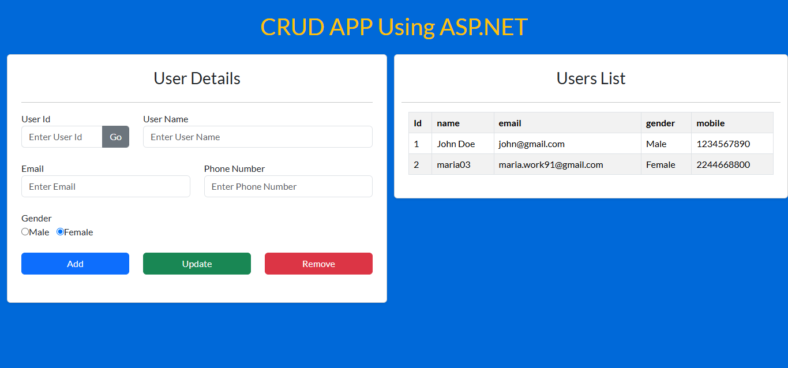

# ASP.NET CRUD Application



This is a basic CRUD application built using ASP.NET. Follow the steps below to set up the application and ensure it runs correctly.

## Prerequisites

1. Visual Studio (2019 or later) with ASP.NET workload installed.
2. SQL Server Express or higher installed with local database support.

## Setup Instructions

### 1. Create the Database

1. Open **SQL Server Management Studio** or use the built-in SQL Server in Visual Studio.
2. Create a new database file with the name `user.mdf`.
   - To do this in Visual Studio:
     1. Go to the **Server Explorer** (Ctrl+Alt+S).
     2. Right-click on **Data Connections** and select **Add Connection...**.
     3. Choose **Microsoft SQL Server Database File (SQLClient)**.
     4. Specify the file name as `user.mdf` and click **OK**.

3. Once the database is created, create a table named `data` with the following fields:

| Field Name | Data Type      | Constraints           |
|------------|----------------|-----------------------|
| `id`       | `int`          | Primary Key, Identity |
| `name`     | `nvarchar(100)`| Not Null             |
| `email`    | `nvarchar(100)`| Not Null, Unique     |
| `gender`   | `nvarchar(10)` | Not Null             |
| `mobile`   | `nvarchar(15)` | Not Null             |

### SQL Script for Table Creation
You can use the following SQL script to create the table:

```sql
CREATE TABLE data (
    id INT IDENTITY(1,1) PRIMARY KEY,
    name NVARCHAR(100) NOT NULL,
    email NVARCHAR(100) NOT NULL UNIQUE,
    gender NVARCHAR(10) NOT NULL,
    mobile NVARCHAR(15) NOT NULL
);
